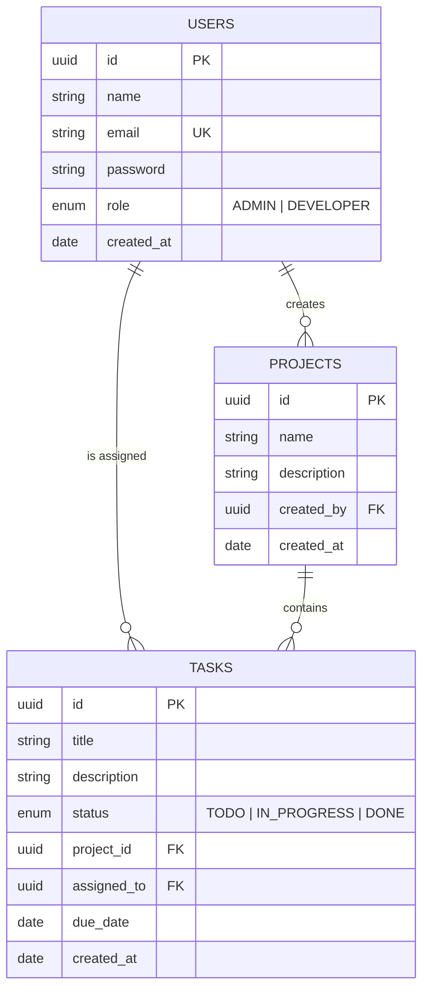

# TMT — Task Management Tool

A production-quality Project Management System built with **Node.js + TypeScript**, **Next.js App Router**, and **PostgreSQL**.

---

## Architecture Overview

```
┌──────────────────────────────────────────────────────┐
│                    FRONTEND (Next.js)                │
│  Pages: /login  /dashboard  /tasks                   │
│  Context → Hooks → API Client (Axios)                │
└─────────────────────┬────────────────────────────────┘
                      │ HTTP/REST
┌─────────────────────▼────────────────────────────────┐
│              BACKEND (Express + TypeScript)           │
│                                                      │
│  Routes → Controllers → Services → Repositories     │
│                    ↓           ↓                     │
│            Zod Schemas    Prisma ORM                 │
│              (Validation)     ↓                      │
│                         PostgreSQL                   │
└──────────────────────────────────────────────────────┘
```

### Clean Architecture Layers

| Layer          | Responsibility                                          |
|----------------|---------------------------------------------------------|
| **Routes**     | Map HTTP endpoints to controllers                       |
| **Controllers**| Parse request, call service, send response              |
| **Services**   | Business logic, orchestration, throws `AppError`        |
| **Repositories**| All DB queries via Prisma (single source of truth)     |
| **Schemas**    | Zod request validation — coerces and validates input    |
| **Middleware** | JWT auth, RBAC, validation, centralized error handler   |

---

## ER Diagram



---

## Project Structure

```
Task_management_Techbrien/
├── Tmt-server/               ← Express REST API
│   ├── prisma/
│   │   ├── schema.prisma     ← DB schema
│   │   └── seed.ts           ← Seed script
│   ├── src/
│   │   ├── config/           ← Env config
│   │   ├── types/            ← TypeScript types
│   │   ├── utils/            ← JWT, bcrypt, pagination
│   │   ├── schemas/          ← Zod validation schemas
│   │   ├── middleware/       ← Auth, RBAC, error handler
│   │   ├── repositories/     ← Prisma data access
│   │   ├── services/         ← Business logic
│   │   ├── controllers/      ← HTTP handlers
│   │   ├── api/routes/       ← Express routes
│   │   └── app.ts            ← Entry point
│   └── tests/                ← Jest unit tests
│
├── Tmt-web/                  ← Next.js App Router frontend
│   └── src/
│       ├── app/              ← Pages (login, dashboard, tasks)
│       ├── components/       ← UI, layout, domain components
│       ├── context/          ← AuthContext
│       ├── hooks/            ← useProjects, useTasks
│       ├── lib/              ← Axios client, auth helpers
│       └── types/            ← Shared TypeScript types
│
└── docker-compose.yml
```

---

## Setup Instructions

### Prerequisites
- Node.js 20+
- PostgreSQL 14+ (or Docker)

### 1. Database (Docker)

```bash
docker compose up db -d
```

Or point `DATABASE_URL` at an existing PostgreSQL instance.

### 2. Backend

```bash
cd Tmt-server
npm install
cp .env.example .env          # Fill in your values
npm run db:migrate               # Creates tables\nnpm run db:seed               # Creates admin user for login
npm run dev
# Server: http://localhost:5000
```

### 3. Frontend

```bash
cd Tmt-web
npm install
cp .env.example .env.local    # Set NEXT_PUBLIC_API_URL
npm run dev
# App: http://localhost:3000
```

### 4. Full stack with Docker

```bash
cp .env.example .env          # at root
docker compose up --build
```

### Default Credentials (after seed)

| Role  | Email         | Password  |\n|-------|---------------|-----------|\n| Admin | admin@tmt.com  | Admin@123 |

---

## API Endpoints

### Auth
| Method | Path              | Auth | Description           |
|--------|-------------------|------|-----------------------|
| POST   | /api/v1/auth/login| ✗    | Login, receive JWT    |
| GET    | /api/v1/auth/me   | ✓    | Get current user      |

### Users *(Admin only)*
| Method | Path           | Description        |
|--------|----------------|--------------------|
| POST   | /api/v1/users  | Create user        |
| GET    | /api/v1/users  | List users (paged) |

### Projects *(All authenticated)*
| Method | Path                | Description           |
|--------|---------------------|-----------------------|
| POST   | /api/v1/projects    | Create project        |
| GET    | /api/v1/projects    | List projects (paged) |
| GET    | /api/v1/projects/:id| Get project by ID     |
| PUT    | /api/v1/projects/:id| Update project        |
| DELETE | /api/v1/projects/:id| Delete project        |

### Tasks *(All authenticated)*
| Method | Path                      | Description                          |
|--------|---------------------------|--------------------------------------|
| POST   | /api/v1/tasks             | Create task                          |
| GET    | /api/v1/tasks             | List tasks (filter + paginate)       |
| GET    | /api/v1/tasks/:id         | Get task by ID                       |
| PUT    | /api/v1/tasks/:id         | Update task                          |
| PATCH  | /api/v1/tasks/:id/assign  | Assign task to user                  |
| DELETE | /api/v1/tasks/:id         | Delete task                          |

#### Task Filters (query params)
```
GET /api/v1/tasks?projectId=<uuid>&status=IN_PROGRESS&assignedTo=<uuid>&limit=10&cursor=<cursor>
```

---

## Running Tests

```bash
cd Tmt-server
npm test              # All unit tests
npm run test:coverage # With coverage report
```

---

## Tech Stack

| Layer      | Technology                              |
|------------|-----------------------------------------|
| Backend    | Node.js + TypeScript + Express          |
| ORM        | Prisma 5                                |
| Database   | PostgreSQL 16                           |
| Validation | Zod                                     |
| Auth       | JWT (jsonwebtoken) + bcryptjs           |
| Frontend   | Next.js 14 App Router + TypeScript      |
| Styling    | Tailwind CSS                            |
| HTTP Client| Axios                                   |
| Testing    | Jest + ts-jest                          |
| Container  | Docker + Docker Compose                 |

